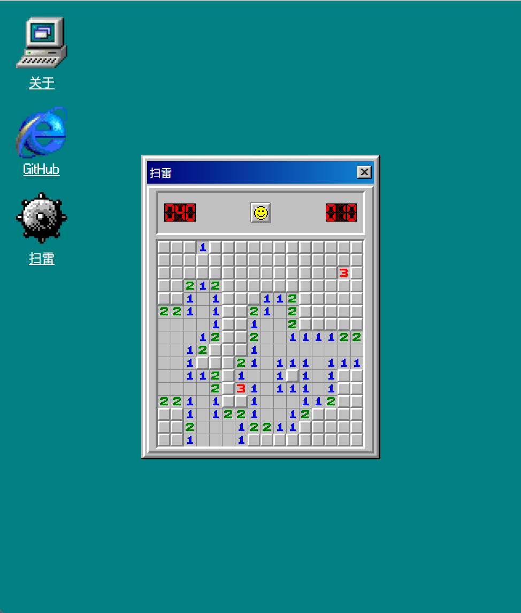
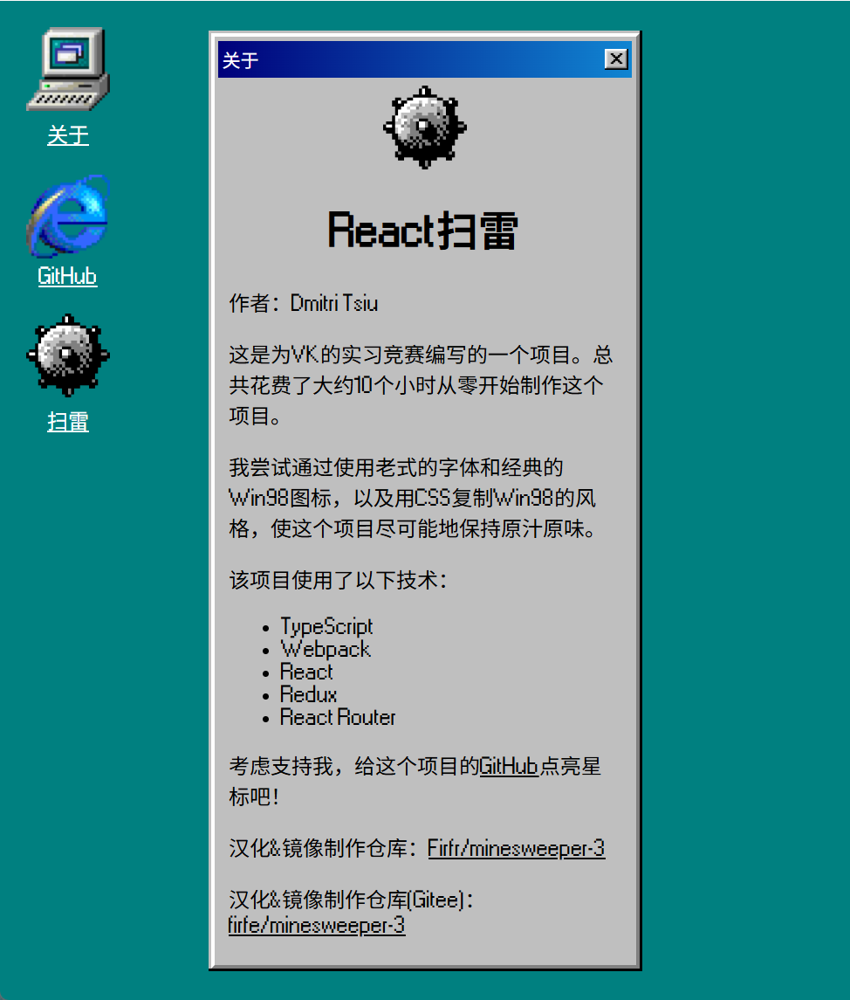

## 汉化&修改

当前制作镜像版本(或截止更新日期)：2025年09月10日

首先感谢原作者的开源。  
原项目没有中文和docker镜像，我制作了docker镜像，基于原项目编译好的分支`gh-pages`制作而成。

- 原项目地址
  - 官网 https://laoqiu233.github.io/minesweeper-react
  - GitHub仓库 https://github.com/laoqiu233/minesweeper-react
- 我汉化和构建docker镜像的仓库
  - GitHub仓库 https://github.com/Firfr/minesweeper-3
  - Gitee仓库 https://gitee.com/firfe/minesweeper-3

具体汉化了那些内容，请参考[翻译说明](./翻译说明.md)。

只做了汉化和简单修改，有问题，请到原作者仓库处反馈。

欢迎关注我B站账号 [秦曱凧](https://space.bilibili.com/17547201) (读作 qín yuē zhēng)  

有需要帮忙部署这个项目的朋友,一杯奶茶,即可程远程帮你部署，需要可联系。  
微信号 `E-0_0-`  
闲鱼搜索用户 `明月人间`  
或者邮箱 `firfe163@163.com`  
如果这个项目有帮到你。欢迎start。

有其他的项目的汉化需求，欢迎提issue。或其他方式联系通知。

### 镜像

从阿里云或华为云镜像仓库拉取镜像，注意填写镜像标签，镜像仓库中没有`latest`标签

容器内部端口`5140`，可通过设置参数来指定监听端口。

- 国内仓库
  - AMD64镜像
    ```bash
    swr.cn-north-4.myhuaweicloud.com/firfe/minesweeper-3:2025.09.10
    ```
  - ARM64镜像
    ```bash
    swr.cn-north-4.myhuaweicloud.com/firfe/minesweeper-3:2025.09.10-arm64
    ```
- DockerHub仓库
  - AMD64镜像
    ```bash
    firfe/minesweeper-3:2025.09.10
    ```
  - ARM64镜像
    ```bash
    firfe/minesweeper-3:2025.09.10-arm64
    ```

### docker run 命令部署

```bash
docker run -d \
--name minesweeper-3 \
--network bridge \
--restart always \
--log-opt max-size=1m \
--log-opt max-file=1 \
-p 5140:5140 \
swr.cn-north-4.myhuaweicloud.com/firfe/minesweeper-3:2025.09.10
```
在命令最后追加`-p 端口`自定义端口

### compose 文件部署 👍推荐

```yaml
#version: '3'
name: minesweeper-3
services:
  minesweeper-3:
    container_name: minesweeper-3
    image: swr.cn-north-4.myhuaweicloud.com/firfe/minesweeper-3:2025.09.10
    network_mode: bridge
    restart: always
    logging:
      options:
        max-size: 1m
        max-file: '1'
    ports:
      - 5140:5140
    # 指定端口
    # command: ["-p", "自定义端口"] 
```

### 修改说明

这里对除了汉化之外的代码修改的说明。  
增加修改部分具体见 [修改说明](./修改说明.md)。

增加目录 `./图片`
新增文件 `./.dockerignore`、`./Dockerfile`、`./翻译说明.md`、`./修改说明.md`、

### 效果截图

|  |  |
|-|-|
